### f3
0秒後Aが出力され、その後Xエラーが発生し、その後Bが出力、さらにそのあとCが出力される。

```mermaid
gantt
    title f3
    dateFormat  s
    axisFormat |
        wait0 : w0, 0, 0.5s
        logA : l1, after w0, 0.2s
        errX : e1, after l1, 0.2s
        logB : l2, after e1, 0.2s
        logC : l3, after l2, 0.2s
```

#### 結果
C
A
Error X

### f4
2秒後、Aが出力され40を返し、この40を引数に次のチェーンが走る。1000秒後、Bが出力され100が返される。さらにこの100を引数に最後100が出力される。

```mermaid
gantt
    title f4
    dateFormat  s
    axisFormat |
        wait2 : w2, 0, 2s
        logA : l1, after w0, 1s
        40 : v1, after l1, 1s
        wait100: w2, after v1, 2.5s
        logB : l2, after w2, 1s
        100 : v2, after l2, 1s
        logv : l3, after v2, 1s
```

#### 結果
wait2
A
wait(1000)
B
100

### f5
2つ目のthenで1つ目のチェーンは切れる。この場合、２つ目のthenは即時実行されたとみなされるので、2つめと３つめのthenは同時に走る。

```mermaid
gantt
    title f5
    dateFormat  s
    axisFormat |
        wait2 : w2, 0, 2s
        logA : l1, after w0, 1s
        40 : v1, after l1, 1s
        wait1: w2, after v1, 1s
        logB : l2, after w2, 1s
        100 : v2, after l2, 1s
        40 : l3, after v1, 1s
```

#### 結果
wait2
wait1
B
A
40

### f6
2つのthenが同時に並列で実行される。

```mermaid
gantt
    title f6
    dateFormat  s
    axisFormat |
        wait1 : w1, 0, 1s
        logA: l1, after w1, 0.5s
        wait1 : w2, after l1, 1s
        logB : l2, after w2, 0.5s
        wait2 : w3, after l1, 2s
        logB : l2, after w3, 0.5s
```

#### 結果
wait1
A
wait1
wait2
B
C

### f7
一度解決されたPromiseの結果は固定されているので、もう一度呼ぶと即座にthenは実行される。ただしチェーンは切れている。

```mermaid
gantt
    title f7
    dateFormat  s
    axisFormat |
        wait1 : w1, 0, 1s
        logA: l1, after w1, 0.5s
        wait2 : w2, after l1, 2s
        logB : l2, after w2, 0.5s
        logC : l2, after w2, 0.5s
```

#### 結果
wait1
wait2
A
B
C

### f8
1つ目のエラーがキャッチされるため、2つめのエラーは無視される。

```mermaid
gantt
    title f8
    dateFormat  s
    axisFormat |
        wait1 : w1, 0, 1s
        errX: e1, after w1, 0.5s
        msg(errX) : m, after e1, 1s
        logA : l2, after m, 0.5s
```

#### 結果
wait1
Error X occurred
A

### f9

```mermaid
gantt
    title f9
    dateFormat  s
    axisFormat |
        wait1 : w1, 0, 1s
        42 :n, after w1, 0.5s
        errY : e1, after n, 1s
        msg(errY) : m, after e1, 1s
        logA : l2, after m, 0.5s
```

#### 結果
wait1
Error Y occurred
A

### f10
thenの引数の１つ目は成功したとき、２つ目は失敗したときに呼ばれる関数。この時errYが呼ばれる。

```mermaid
gantt
    title f10
    dateFormat  s
    axisFormat |
        wait1 : w1, 0, 1s
        42: n, after w1, 0.5s
        errY : m, after n, 1s
```

#### 結果
wait1
A　←Aも呼ばれる
throw new　Error: Error Y occurred

### f11
errは非同期処理でないのでキャッチできない

```mermaid
gantt
    title f11
    dateFormat  s
    axisFormat |
        errX : e1, 0, 1s
```

#### 結果
Error X occurred

### f12
非同期処理であるsetTimeoutの中でエラーされているのでキャッチできる

```mermaid
gantt
    title f11
    dateFormat  s
    axisFormat |
        errX : e1, 0, 0.5s
        setT : w1, after e1, 0.5s
        msg(errX) : m, after e1, 0.5s
```

#### 結果
throw new　Error: Error X occurred