### h1

```mermaid
gantt
    title h1
    dateFormat  s
    axisFormat |
        wait3 : w3, 0, 3s
        logA : l1, after w3, 1s
        wait2 : w2, after l1, 2s
        logB : l2, after w2, 1s
        wait1 : w1, after l2, 1s
        logC : l3, after w1, 1s
```

### 結果
3秒待つ
A
2秒待つ
B
1秒待つ
C

### h2

```mermaid
gantt
    title h2
    dateFormat  s
    axisFormat |
        errX : e1, 0, 1s
        msg(errX) : l1, after e1, 1s
```

### 結果
エラーXがキャッチされた

### h3
aysnc functionは、関数の戻り値がPromiseになる。よって、このasync関数が返すPromiseは中身のerrXによって失敗となるため、h2はそのままerrXが返されるのに対しh3ではPromiseの失敗(rejected)が返される。

```mermaid
gantt
    title h3
    dateFormat  s
    axisFormat |
        errX : e1, 0, 1s
        msg(rejected) : l1, after e1, 2s
```

### 結果
エラーXがキャッチされなかった

### h4
awaitで書かれる処理は逐次実行なため、await p2はawait p1を待つ。await p1でエラー発生し、その時点でエラーキャッチされるので2つの例外は同時にキャッチできない。

```mermaid
gantt
    title h4
    dateFormat  s
    axisFormat |
        wait2 : w2, 0, 2s
        errX : e1, after w2, 1s
        msg(errX) : l1, after e1, 2s
```

### 結果
エラーYが発生した上、キャッチされなかった