### i1
anyの中のwait2()が完了するのは2秒後なので、anyではwait1が結果として返される。ただし、wait2()はanyの結果として帰らないだけで実行はされるが、無視される。
メモ：Promise.any() は、複数の Promise のうち、最初に「成功（fulfilled）」したものの結果を返すメソッド

```mermaid
gantt
    title i1
    dateFormat  s
    axisFormat |
        wait1 : w1, 0, 1s
        42 : n1, after w1, 0.5s
        wait2 : w2, after n1, 2s
        42 : n2, after w2, 0.5s
        wait2 : w3, 0, 2s
        100 : n3, after w3, 2s
```

### 結果
wait1
wait2
42
wait2
100

### i2
結果が格納される順番はallの配列に記述した順番。

```mermaid
gantt
    title i2
    dateFormat  s
    axisFormat |
        wait3 : w3, 0, 3s
        logA : l1, after w3, 0.5s
        wait2 : w2, 0, 2s
        logB : l2, after w2, 0.5s
        wait1 : w1, 0, 1s
        logC : l3, after w1, 0.5s
        [A,B,C] : l3, after l1, 1s
```

### 結果
wait3
wait2
wait1
C
B
A
[ 'A', 'B', 'C' ]

### i3
メモ：Promise.allは1つでも失敗したら全体が失敗になる。

```mermaid
gantt
    title i3
    dateFormat  s
    axisFormat |
        wait3 : w3, 0, 3s
        errX : e1, after w3, 0.5s
        wait2 : w2, 0, 2s
        logB : l2, after w2, 0.5s
        wait1 : w1, 0, 1s
        errY : e2, after w1, 0.5s
        msg(errY) : m1, after e2, 1s
        42 : n1, after m1, 0.5s
        wait3 : w4, after n1, 3s
        42 : n2, after w4, 0.5s
```

### 結果
wait3
wait2
wait1
Y
42
wait3
B
0

### i4
Promise.allが終わるのはすべての関数実行が完了するときなので、1s遅いp1が終わったタイミングでPromiseが完了する。vは5になる。
### 修正前結果
wait1
wait2
wait2
wait2
wait2
wait2
wait2
wait2
wait2
wait2
wait2
5
### 修正後結果
wait1
wait2
wait2
wait2
wait2
wait2
wait2
wait2
wait2
wait2
wait2
10