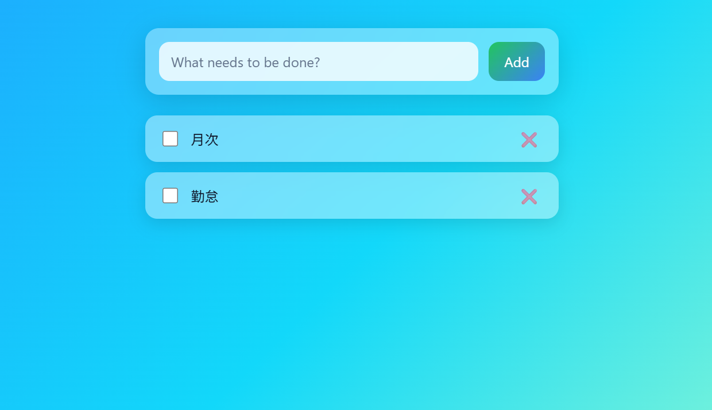

### 修正後タスク管理アプリ

### プロンプト
以下の HTML, JavaScript および CSS は ToDo アプリのソースコードです。CSS を変更して見栄えを良くしてください。青や緑をベースに、スタイリッシュで透明感のある感じにしてください。

### 変更点について
- レイアウト・・・bodyに対しフレックス要素などが設定されたことで、中央揃えで縦一列に配置されるようになった。また、フォーム部分はmaxの幅が設定され、広がりすぎないようになっている。
- 色・・・指定したイメージの線形グラデーションを、background: linear-gradientを用いて背景にかけられている。角度指定もできる。
- 要素・・・ボタンやTodoリストのホバー時の挙動が加わった。