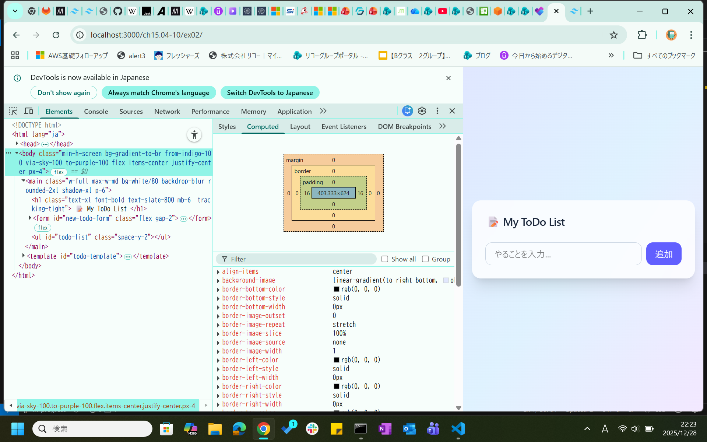
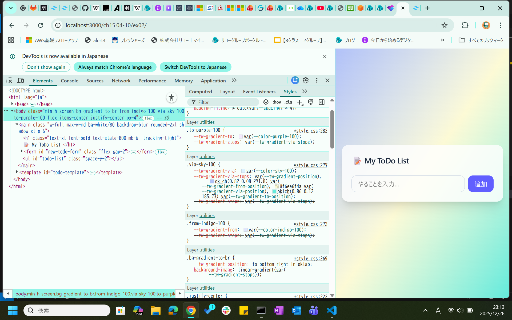
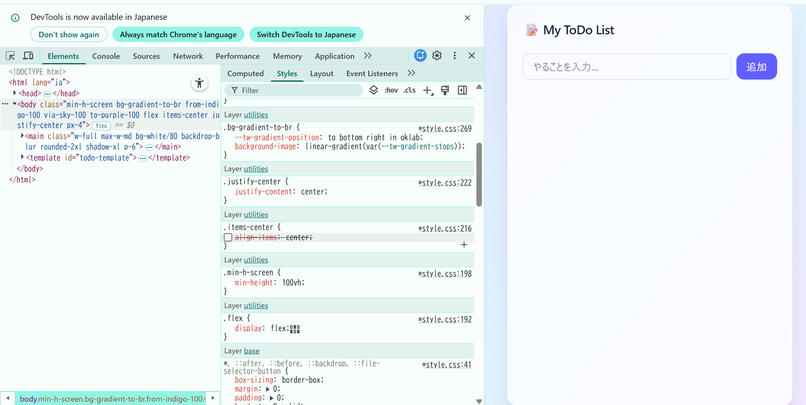
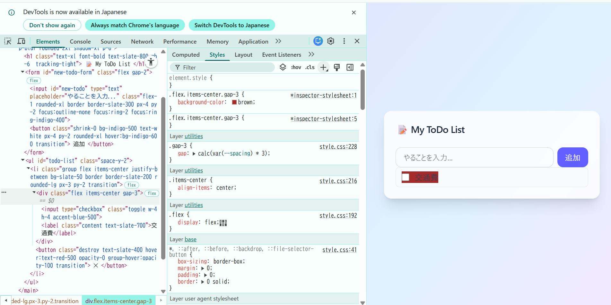
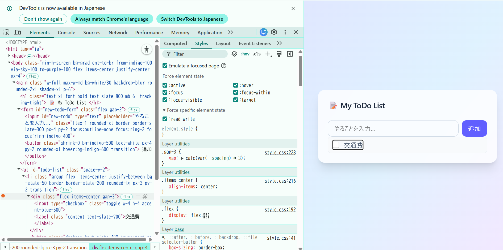
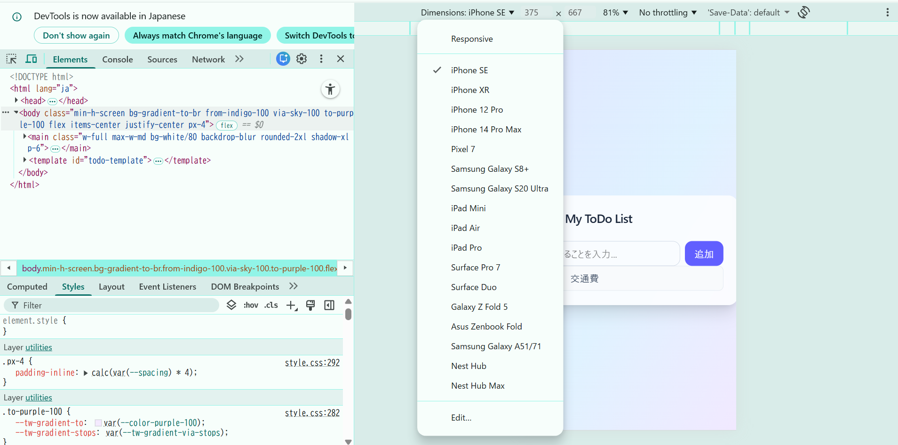
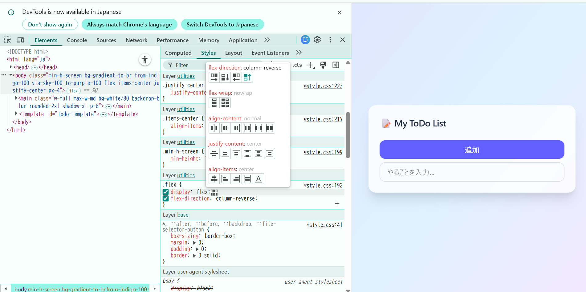
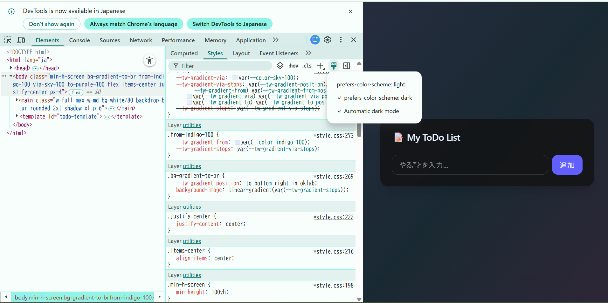

### 1.開発者ツールからの設定変更

上記画面から、バックグラウンドのグラデーションを変更

### 2.開発者ツールでCSSに関して実行できる操作3選
- Stylesタブでのcss変更

特定の要素に対し、cssを追加できる。

要素の:hover, :active, :focus, :visitedなどをオンした状態にできる。

画面サイズを色々なデバイス仕様にできる。

その他：
レイアウト変更。

darkモードにできる。

参考
- https://ics.media/entry/230317/

### 3.
一度も使用していないクラスはstyle.cssに記述されないため、開発者ツールから追加しても適用されない（無いものを参照することになる）。