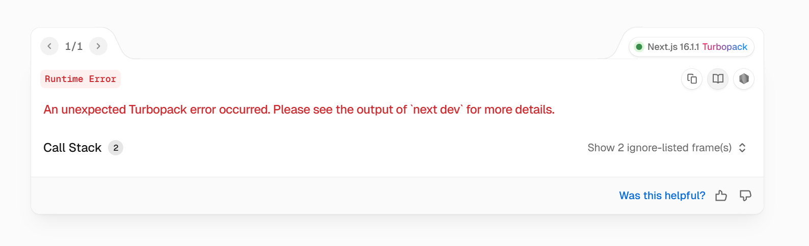
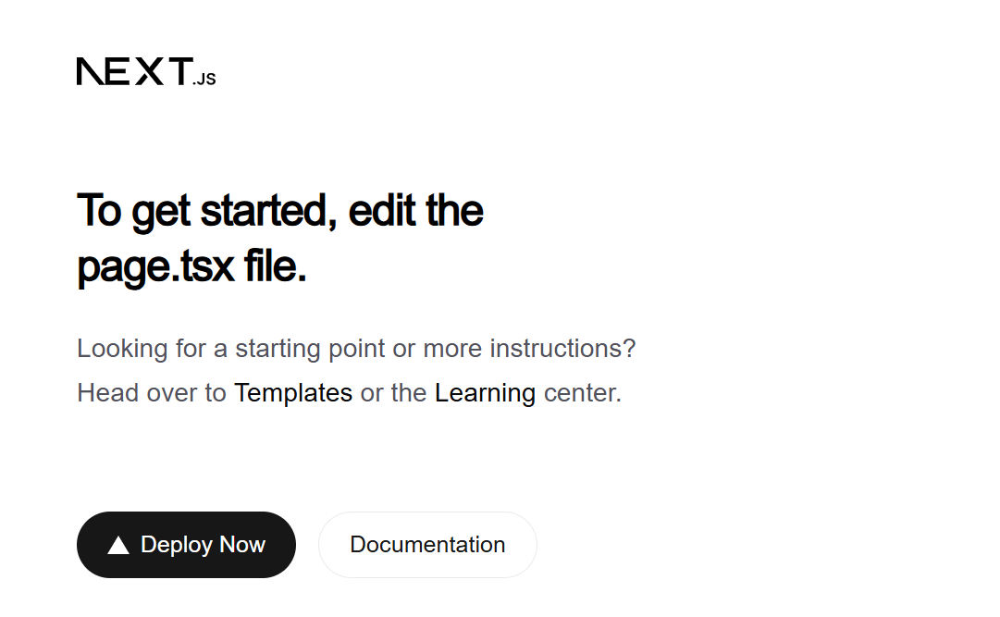
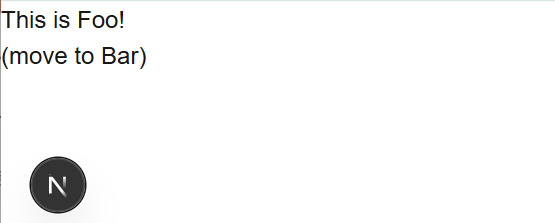
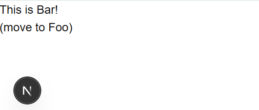
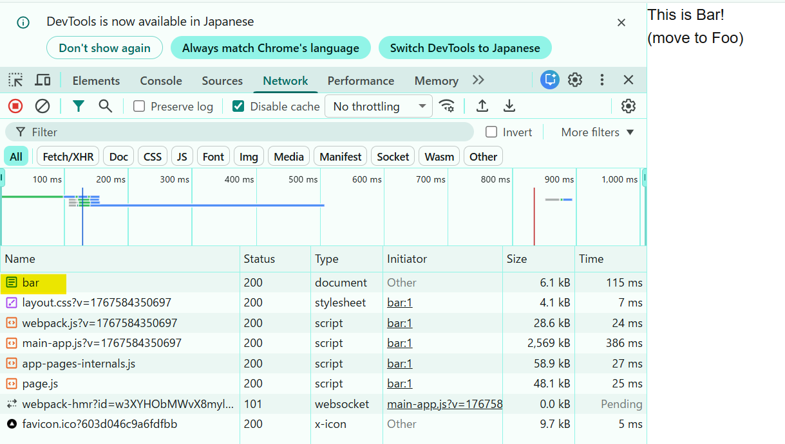
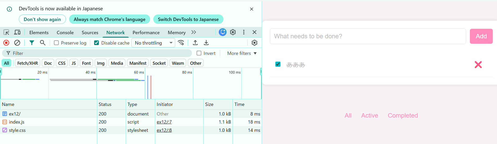
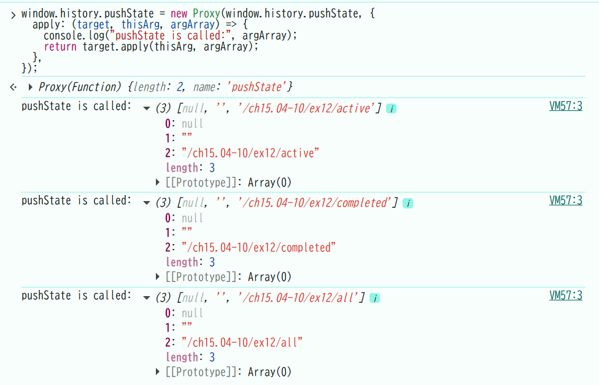

## 準備

npm run devではエラーが出たため以下npm run dev -- --webpackで実行し、localhostに接続。

それぞれ、/foo,/barの画面。FooとBarを押すと遷移する。

## 1
### ネットワーク

fooとbarを交互に何度か押したときのネットワークの確認。
type:fetchとあり、通信をしているように見えるが、これはApp routerがローカルサーバにリクエストを行っているもの。

### pushStateの実行

最初にnew Proxyが作られた後、foo/barの遷移ボタンが押されるごとに実行される。つまり、URLの更新をトリガーに実行される。

### リロード

/barでリロードした際、全てのファイルの再読み込みが発生した。また、画面は/barから変わらなかった。/fooでも同様。

## 2.ex12との比較
### ネットワーク

先述と違い、こちらはActiveやCompletedを切り替えても何の通信もしていなかった。ネットワークで確認できるのは、ずっとex/12,index.js,style.cssの3つ。

### pushStateの実行

先述と同様に、URLの更新をトリガーにして実行された。

### リロード
ex12/でリロードを行うと、ex/12,index.js,style.cssが再読み込みされる。
また、他のURL（/all,/active,/completed）では404エラー。

## 2.Linkについて
ex12と、今回の違いは再読み込みの際の挙動と、URLが変わった際のネットワーク通信だった。
これらの役割を担っているのがNode.jsのLinkと考えられる。以下、調べたLinkの概要を記す。
- ブラウザでフルリロードしない（必要な部分だけ読みこむ）
- 画面遷移が早い（SPA的）
- prefetchを行う(遷移先のルートやデータをバックグラウンドで先読みする)
<"a">タグは、ページをフルリロードし、JavaScriptの状態やスクロール位置がリセットされる違いがる。

参考
- https://nextjs-ja-translation-docs.vercel.app/docs/api-reference/next/link
- https://note.com/spark_branding_/n/nf90062b3ddd1
