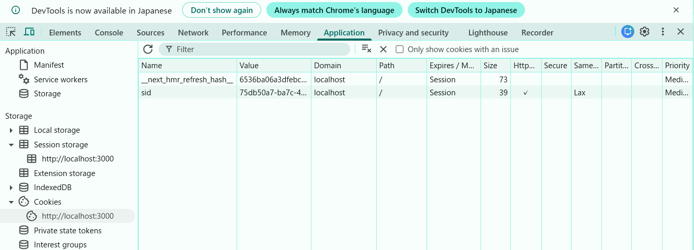
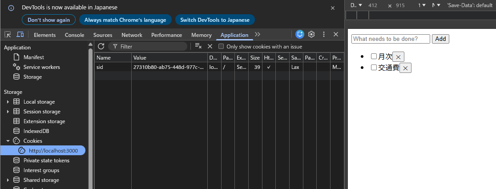
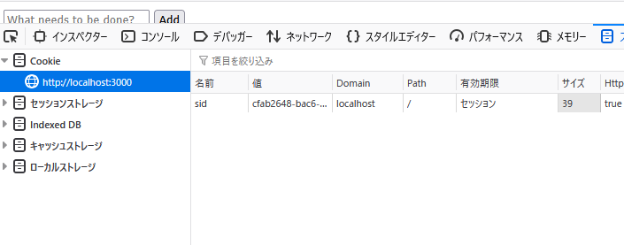

### index.js でdocument.cookie プロパティを console.logで表示する
`
クッキー: __next_hmr_refresh_hash__=6536ba06a3df～～～
`
上記から変化なし。
理由：クッキーは要素には依存しない。

### ブラウザの開発者コンソールで http://localhost:3000/ の Cookie を表示する

上記から変化なし。
理由：クッキーは要素には依存しない。

### ToDo アプリのタブをリロードする
リロード後のクッキー確認でも、２つの値に変化なし。
理由：セッションidはセッションが作成されたときに一度だけ作られ、クッキーに保存される。

### 同一ブラウザの異なるタブやウィンドウで http://localhost:3000/ を開いて ToDo リストの状態を確認する
別タブやウィンドウで開くと、上記3つの確認事項と同様のクッキー、sidとなった。
理由：クッキーはブラウザごと・プロファイルごとに共有されるから。

### シークレットウィンドウや異なるブラウザで http://localhost:3000/ を開いて ToDo リストの状態を確認する
シークレットウィンドウ、異なるブラウザではクッキー情報なし。また、sidは異なる。
シークレットウィンドウ：

firefox：

理由：クッキーはブラウザごと・プロファイルごとに共有されるから。通常のセッションとは違う、一時的なCookieが使われるので、通常ウィンドウのクッキーは読めない。（今回確認したのは別ブラウザ→Chrome/Firefox）

### http://127.0.0.1:3000/ を開いて ToDo リストの状態を確認する
以下エラー。htmlの表示はされる。
`
Access to fetch at 'http://localhost:3000/api/tasks' from origin 'http://127.0.0.1:3000' has been blocked by CORS policy: Response to preflight request doesn't pass access control check: No 'Access-Control-Allow-Origin' header is present on the requested resource.Understand this error
localhost:3000/api/tasks:1  Failed to load resource: net::ERR_FAILEDUnderstand this error
:3000/favicon.ico:1  Failed to load resource: the server responded with a status of 404 (Not Found)
`
理由：CORS設定で弾かれている（許可されていない）アドレスのため。