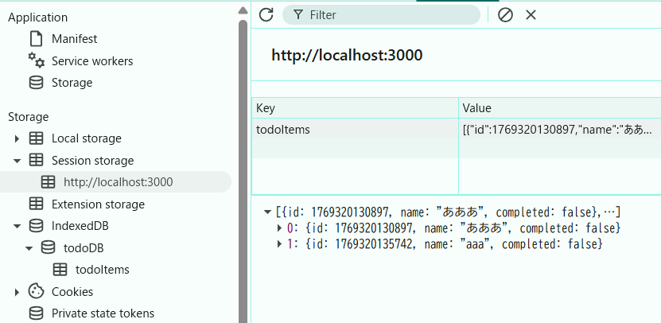
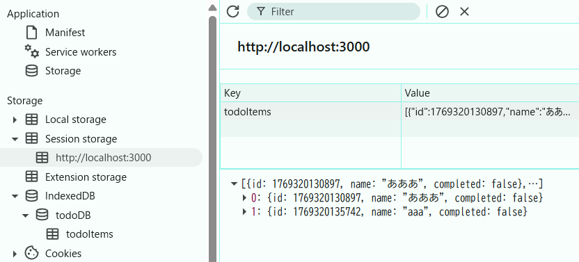
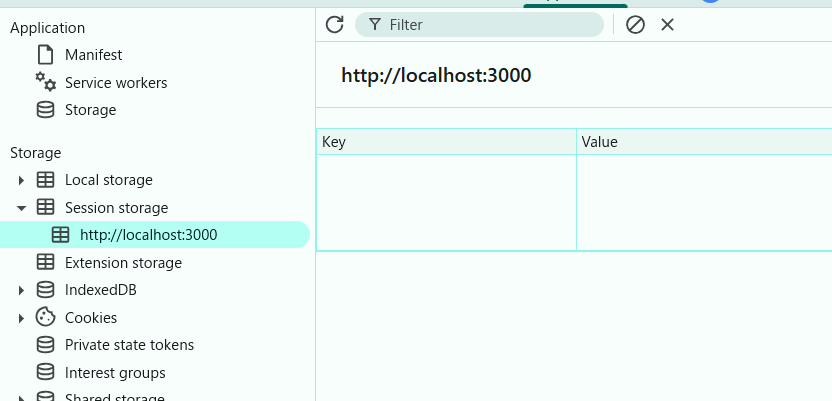

### localStorage とsessionStorage
以下教科書より
- localStorage とsessionStorage の違いは、ストレージの有効期間とスコープ
- sessionStorage を使って保存されたデータの有効期間は、データを保存したスクリプトが実行されている最上位ウィンドウやブラウザタブと同じ
- オリジンの異なるドキュメント間では、sessionStorage を共有することはできない

### sessionstrogeでの違いを確認
リロードをしてもアイテムは保たれる。
更新前

更新後

タブを閉じた後は保持期間が切れてしまう。
タブを閉じた後
