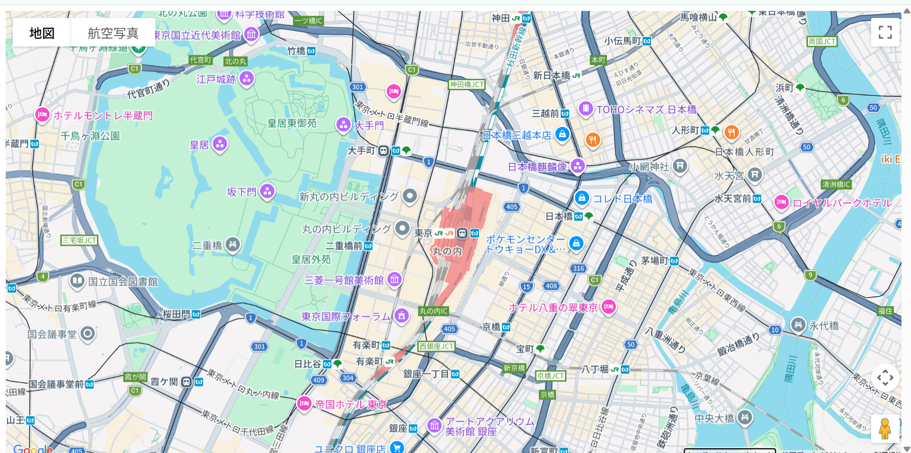
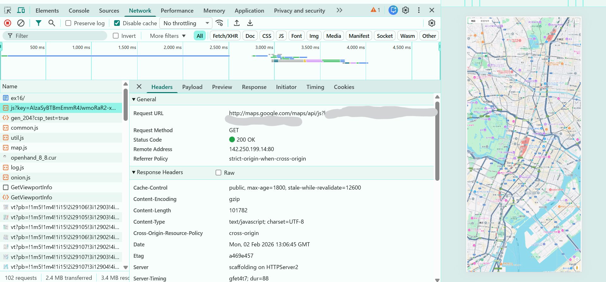

### 一般サービスのCORS設定確認
以下リンクを参考に、Google Map APIでGoogle CloudプラットフォームからAPIを有効化。
index.htmlを作成し、指定した座標を表示。

デベロッパーツールでCORS設定を確認。

以下、CORS設定にかかわりそうなところ
`
Cross-Origin-Resource-Policy：cross-origin →どのオリジンからもOK
Timing-Allow-Origin：*　→他オリジンのJavaScriptからTiming情報を取得していいか
Vary: Origin　→Varyはキャッシュに対する注意書き
Vary: X-Origin
Vary: Referer
`

参考
https://qiita.com/Haruka-Ogawa/items/997401a2edcd20e61037