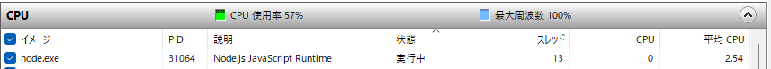
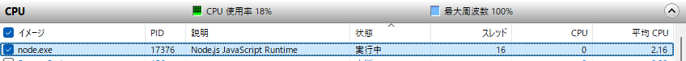

### マルチスレッド
1つのプログラムを実行する際に、アプリのプロセスを複数のスレッドに分けて並行処理する流れのこと。
対義語はシングルスレッドで、上から順番に1つずつ処理を行うこと。

### フィボナッチ数計算の確認
1回目
`
項数45 スレッド数4
Worker 0 execution time: 1.994s
Worker 3 execution time: 2.778s
Worker 1 execution time: 4.253s
Worker 2 execution time: 6.482s
Total execution time: 6.489s
Fibonacci number: 1836311902
`
リソースモニター

2回目
`
項数45 スレッド数1
Worker 0 execution time: 12.757s
Total execution time: 12.766s
Fibonacci number: 1836311902
`
リソースモニター

### 考察
PC概要
CPUスペック：Intel Core Ultra 7 265U
スレッド数：14
スレッドを多くすると処理自体は早くなるが他のアプリのスレッドは残す必要がある。
例えば、今回のフィボナッチ数計算はスレッドを5に増やしても6秒程度だった。処理の速さを考慮しても、スレッド数は最大で4がいいと考える。