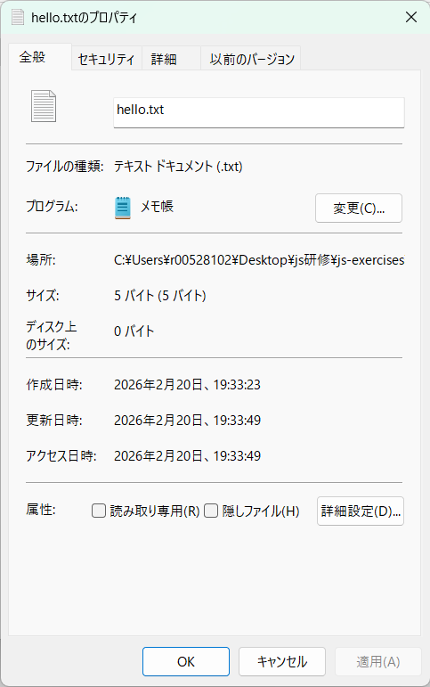
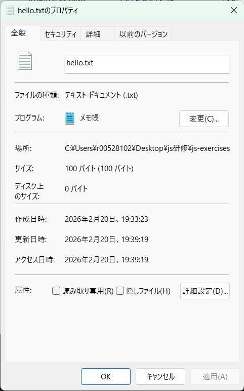

### 結果
実行前のtxtファイル
5バイト

拡張実行後のtxtファイル
100バイト

hello.txtファイルを確認すると、最初に打った文字の後がnull（0x00）で埋められていた。

- 実際に埋められた部分に実データは存在しない（0があるわけではない）
- スパースとして扱う（スパースとは、0ばかりの部分を実際にはディスクに保存せず、読み出し時にOSが0として返してくれるファイルのこと）