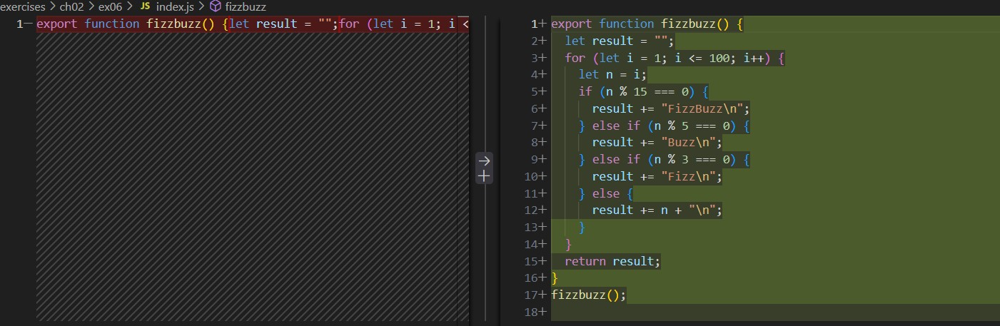

### 何も設定していない場合の実行
ESLintのバージョン：v8.57.1

format_sample.js

```
> node .\ch17\ex01\format_sample.js
  let jsx = <button
            ^

SyntaxError: Unexpected token '<'
```

lint_sample.js

```
>node ch17/ex01/lint_sample.js
with (Math){
^^^^
```

### 設定後

npm run lintの実行

```
> preset-js@1.0.0 lint
> eslint "ch17/**/*.{js,jsx}"

C:\Users\r00528102\Desktop\js研修\js-exercises\exercises\ch17\ex01\lint_sample.js
  4:1  error  Parsing error: 'with' in strict mode

✖ 1 problems (1 errors, 0 warnings)
```

npm run formatの実行
実行後、exercises/以下にある全ファイルに対して以下のような1行コードや、文字列の""(ダブルクォート)が''(シングルクォート)に修正された。


### メモ
exersies/package.jsonに以下を追記
```
    "lint": "eslint \"ch17/**/*.{js,jsx}\"",
    "lint:fix": "eslint \"ch17/**/*.{js,jsx}\" --fix",
    "format": "prettier . --write", // writeで自動修正
    "format:check": "prettier . --check"
```
また、format_sample.jsはlint対象外に設定
```
    ignores: [
      'node_modules/**',
      'dist/**',
      'ch17/ex01/format_sample.js', // ← 課題要件
    ],
```

途中経過でのエラー

```
 11:1  warning  'a' is never reassigned. Use 'const' instead  prefer-const
 12:1  warning  'x' is never reassigned. Use 'const' instead  prefer-const
 13:1  warning  'y' is never reassigned. Use 'const' instead  prefer-const
```

古いESLintはextends: googleが使えた

- https://qiita.com/reisuta/items/7b16507d90aadccada73
- https://qiita.com/wwwy/items/510f54837432d6c9b4fe
‐ https://zenn.dev/renoa/articles/what-is-eslint
- https://zenn.dev/babel/articles/eslint-flat-config-for-babel
