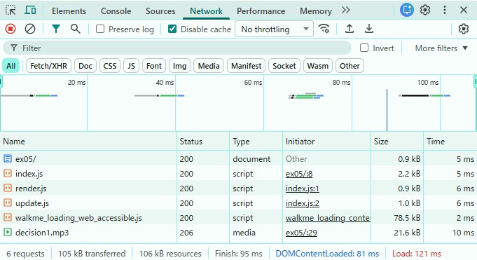
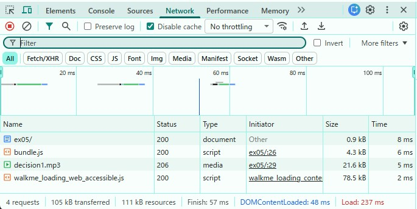

### バンドルしたコードと元のコードを比較し、どのような処理が行われたかを確認しなさい。
バンドル実行後、webpack.config.jsでoutpootとしてバンドルに指定したフォルダ名/ファイル名でex05いかに新しくファイルが生成された。既存のファイル（index.js,render.js,update.js,html）に変化はなし。
```
ex05/
├─ dist/
│  └─ bundle.js
```
また、htmlの読み込みは以下に変更。
```
<!-- <script type="module" src="/ch17/ex05/index.js"></script> --> // 元の読み込み
<script src="dist/bundle.js"></script>
```

### バンドル前後それぞれのコードを利用するページをローカルサーバで配信してブラウザから閲覧できるようにしなさい。開発者ツールで ネットワーク タブを開き、スクリプトのダウンロード時間、ページの読み込み完了時間について比較しなさい。

バンドル前：

スクリプトのダウンロード時間:各ファイル5~8ms
ページの読み込み完了時間:DOMContentLoaded: 81 ms,Load: 123 ms

バンドル後：

スクリプトのダウンロード時間:各ファイル5~8ms
ページの読み込み完了時間:DOMContentLoaded: 48 ms,Load: 237 ms

### メモ
実行結果:
```
>npx webpack
asset bundle.js 10.8 KiB [emitted] (name: main)
runtime modules 670 bytes 3 modules
cacheable modules 5.76 KiB
  ./index.js 3.74 KiB [built] [code generated]
  ./render.js 580 bytes [built] [code generated]
  ./update.js 1.45 KiB [built] [code generated]
webpack 5.105.4 compiled successfully in 95 ms
```

webpackはバンドルしたい単位（=プロジェクト単位）ごとにインストール

参考
- https://qiita.com/calmandhelp/items/d53d36edfe8ea82231af