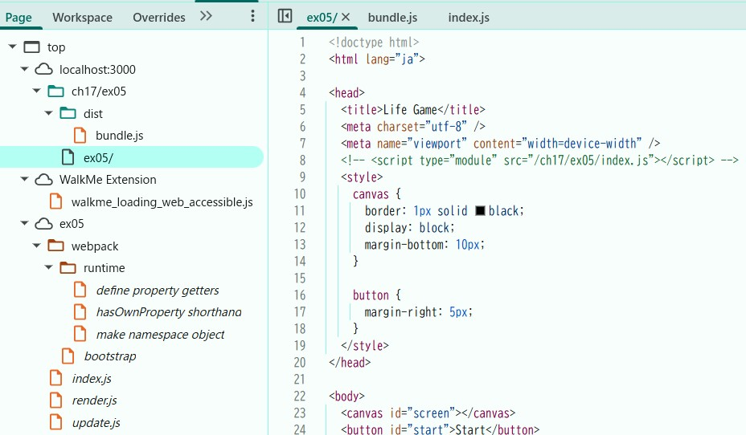
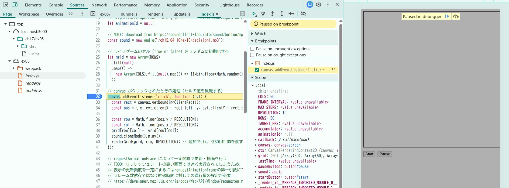

### ソースマップとは
バンドル後のコードと元のソースコードを紐づけるもの。
方法：webpack.config.jsにdevtoolを指定する
→dist/以下にbandle.js.mapが作成された。

### 開発者ツールでソースタブ(Chrome, Edge, Safari) またはデバッガータブ(Firefox) を開き、ソースコードファイルがどのように表示されるかを確認しなさい。
ファイル構成は以下のようになり、元々のコード一式は一番下のex05の中に格納されている。

### バンドルしたコードの実行中に、バンドル前のソースコードファイルに基づいたブレークポイントの設定や変数の値の確認等のデバッグが可能か確認しなさい。
ex05の中に格納されている元のソースコードの行数を選択するとブレイクポイントによる確認ができる。また、同様にScope欄から変数の値の確認ができる。

